.. _basic_usage:

Basic Usage
===========

.. _minimal-use-case:

Minimal Case
------------

For the most basic ThreatIngestor setup, you will want to configure at least
one :ref:`source <source-plugins>`, one :ref:`operator <operator-plugins>`, and
whether you want to run in daemon or job mode.

First create a new ``config.ini`` file, and add the ``[main]`` section:

.. code-block:: ini

    [main]
    daemon = true
    sleep = 900

Set ``daemon`` to ``true`` if you want ThreatIngestor to constantly watch
your sources in a loop; set it to ``false`` if you want to run it manually,
or via cron or some other scheduler. Set ``sleep`` to the number of seconds
to wait between each check - this will be ignored if you disable daemon mode.
Don't set the sleep too low, or you may run into rate limits or other issues.
If in doubt, keep this above 900 (fifteen minutes).

Next, add your sources and operators. For easy testing, we'll use an :ref:`RSS
<rss-source>` source and a :ref:`CSV <csv-operator>` operator:

.. code-block:: ini

    [source:inquest-rss]
    module = rss
    saved_state = 
    url = http://blog.inquest.net/atom.xml
    feed_type = messy

    [operator:csv]
    module = csv
    filename = output.csv

Now that the config file is all set up, run ThreatIngestor:

.. code-block:: console

    python ingestor.py config.ini

It should write out a ``output.csv`` file that looks something like this:

.. code-block:: text

    URL,http://purl.org/dc/dcmitype/,http://blog.inquest.net/blog/2018/02/07/cve-2018-4878-adobe-flash-0day-itw/,"\n On February 1st, Adobe published bulletin  APSA18-01  for CVE-2018-4878 describing a use-after-free (UAF) vulnerability affecting Flash ve..."
    Domain,purl.org,http://blog.inquest.net/blog/2018/02/07/cve-2018-4878-adobe-flash-0day-itw/,"\n On February 1st, Adobe published bulletin  APSA18-01  for CVE-2018-4878 describing a use-after-free (UAF) vulnerability affecting Flash ve..."
    URL,http://purl.org/dc/elements/1.1,http://blog.inquest.net/blog/2018/02/07/cve-2018-4878-adobe-flash-0day-itw/,"\n On February 1st, Adobe published bulletin  APSA18-01  for CVE-2018-4878 describing a use-after-free (UAF) vulnerability affecting Flash ve..."
    ...

Assuming you are running in daemon mode, ThreatIngestor will continue to check
the blog and append new artifacts to the CSV as it finds them.

.. _standard-use-case:

Standard Case
-------------

Generally, you are going to want multiple sources feeding into one or more
operators. Let's consider this standard use case:

Create your ``config.ini``:

.. code-block:: ini

    [main]
    daemon = true
    sleep = 900

For Twitter integration, you'll need to grab the tokens, keys, and secrets
for your Twitter account. Follow these steps from the Twitter documentation:
https://developer.twitter.com/en/docs/basics/authentication/guides/access-tokens.

For ThreatKB, click the profile dropdown in the top right of the page, then
choose "My API Keys". Click the "+" to generate a new token/key pair, and
copy them somewhere safe.

Once you have all the secrets you need, fill out the rest of the ThreatIngestor
configuration file:

.. code-block:: ini

    [source:twitter-inquest-c2-list]
    module = twitter
    saved_state = 
    # https://dev.twitter.com/oauth/overview/application-owner-access-tokens
    token = 
    token_key = 
    con_secret_key = 
    con_secret = 
    # https://dev.twitter.com/rest/reference/get/lists/statuses
    owner_screen_name = InQuest
    slug = c2-feed

    [source:twitter-hxxp-no-opendir]
    module = twitter
    saved_state = 
    # https://dev.twitter.com/oauth/overview/application-owner-access-tokens
    token = 
    token_key = 
    con_secret_key = 
    con_secret = 
    # https://developer.twitter.com/en/docs/tweets/search/api-reference/get-search-tweets.html
    q = hxxp -open

    [source:rss-vendor-x]
    module = rss
    saved_state = 
    url = https://example.com/rss.xml
    feed_type = messy

    [source:rss-vendor-y]
    module = rss
    saved_state = 
    url = https://example.com/rss.xml
    feed_type = messy

    [operator:mythreatkb]
    # Send artifacts to a ThreatKB instance
    module = threatkb
    url = http://mythreatkb
    token = 
    secret_key = 
    state = Inbox

Fill in all the ``token`` and ``secret`` lines with your secrets. You can leave
the ``saved_state`` lines blank, ThreatIngestor will fill them in after the
first run. Replace, remove, and add RSS and Twitter sources as needed to fit
your use case.

Now that everything is all set up, run the ingestor:

.. code-block:: console

    python ingestor.py config.ini

You should see your ThreatKB Inbox start filling up with newly extracted
C2 IPs and domains.
