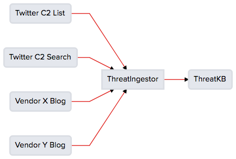

.. _basic_usage:

Basic Usage
===========

All ThreatIngestor configuration is done via YAML. If you're not familiar with YAML, Ansible has a `YAML syntax guide`_ that goes over some of the basics. For the purposes of this documentation, we'll assume no prior knowledge of YAML.

In the use cases below, we'll go into detail on how ThreatIngestor config is layed out, and give some concrete examples you can use right away.

.. _minimal-use-case:

Minimal Case
------------

For the most basic ThreatIngestor setup, you will want to configure at least one source_, one operator_, and set the general settings (as shown below).

First create a new ``config.yml`` file, and add the ``general`` section:

.. code-block:: yaml

    general:
        daemon: true
        sleep: 900
        state_path: state.db

Configure ThreatIngestor to run continuously or manually. If you set ``daemon`` to ``true``, ThreatIngestor will watch your sources in a loop; set it to ``false`` to run manually, or via cron or some other scheduler. Set ``sleep`` to the number of seconds to wait between each check - this will be ignored if ``daemon`` is set ``false``. Don't set the sleep too low, or you may run into rate limits or other issues. If in doubt, keep this above 900 (fifteen minutes). The ``state_path`` should be a local or absolute path where ThreatIngestor will write out the state database, which is used internally to track where it left off in each source (e.g. the most recent blog post processed from an RSS feed).

.. _source:

Next, create the ``sources`` section, and add your sources. To configure the source, you should give it a unique name like ``inquest-rss``. Each source also uses a module like twitter, rss, or sqs. Choose the module for the expected format of the source data. For easy testing, we'll use an :ref:`RSS <rss-source>` source and a :ref:`CSV <csv-operator>` operator for this example.

You can also include a ``include`` to parse ingested artifacts using regex. The include uses a pipe (|) character as the delimeter.

.. code-block:: yaml

    sources:
      - name: inquest-rss
        module: rss
        url: http://blog.inquest.net/atom.xml
        feed_type: messy

      - name: inquest-rss
        module: rss
        url: http://blog.inquest.net/atom.xml
        feed_type: messy
        include: security|threat

Note the dash before the ``name`` key, signifying this and the following keys are part of a single list element. We'll circle back to this distinction below in the "Standard Case" walkthrough. For this source, we assign a name ``inquest-rss``, tell it to use the ``rss`` module, and fill in the required options for the ``rss`` module, which are ``url`` and ``feed_type``.

.. note::

    To see what configuration options each module allows, check out the corresponding documentation on the :ref:`Source Plugins <source-plugins>` and :ref:`Operator Plugins <operator-plugins>` pages.

.. _operator:

Similarly, the operators identify a name, a module, and other settings for output of information extracted from the sources.

.. code-block:: yaml

    operators:
      - name: csv
        module: csv
        filename: output.csv

Here we create an operator using the ``csv`` module, name it ``csv``, and specify a filename where we want to store the output. Note again the dash before the ``name`` key.

Putting it all together, here's our completed ``config.yml`` file:

.. code-block:: yaml

    general:
        daemon: true
        sleep: 900
        state_path: state.db

    sources:
      - name: inquest-rss
        module: rss
        url: http://blog.inquest.net/atom.xml
        feed_type: messy

      - name: inquest-rss
        module: rss
        url: http://blog.inquest.net/atom.xml
        feed_type: messy
        include: security|threat

    operators:
      - name: csv
        module: csv
        filename: output.csv

Now that the config file is all set up, run ThreatIngestor:

.. code-block:: console

    threatingestor config.yml

It should write out a ``output.csv`` file that looks something like this:

.. code-block:: text

    URL,http://purl.org/dc/dcmitype/,http://blog.inquest.net/blog/2018/02/07/cve-2018-4878-adobe-flash-0day-itw/,"\n On February 1st, Adobe published bulletin  APSA18-01  for CVE-2018-4878 describing a use-after-free (UAF) vulnerability affecting Flash ve..."
    Domain,purl.org,http://blog.inquest.net/blog/2018/02/07/cve-2018-4878-adobe-flash-0day-itw/,"\n On February 1st, Adobe published bulletin  APSA18-01  for CVE-2018-4878 describing a use-after-free (UAF) vulnerability affecting Flash ve..."
    URL,http://purl.org/dc/elements/1.1,http://blog.inquest.net/blog/2018/02/07/cve-2018-4878-adobe-flash-0day-itw/,"\n On February 1st, Adobe published bulletin  APSA18-01  for CVE-2018-4878 describing a use-after-free (UAF) vulnerability affecting Flash ve..."
    ...

Assuming you are running in daemon mode, ThreatIngestor will continue to check the blog and append new artifacts to the CSV as it finds them. For further configuration, continue to the :ref:`Standard Case section <standard-case>` or see the detailed sections about :ref:`source plugins <source-plugins>`, and :ref:`operator plugins <operator-plugins>`.

.. _standard-case:

Standard Case
-------------

Generally, you are going to want multiple sources feeding into one or more operators. Let's consider this standard use case:

 Blog."

Create your ``config.yml``:

.. code-block:: yaml

    general:
        daemon: true
        sleep: 900
        state_path: state.db

For Twitter integration, you'll need to grab the tokens, keys, and secrets for your Twitter account. Follow these steps from the Twitter documentation: https://developer.twitter.com/en/docs/basics/authentication/guides/access-tokens.

For `ThreatKB`_, while logged in to your ThreatKB instance, click the profile dropdown in the top right of the page, then choose "My API Keys". Click the "+" to generate a new token/key pair, and copy them somewhere safe.

Once you have all the secrets you need, create a new section in your config file called ``credentials``, and two list elements inside it for Twitter and ThreatKB:

.. code-block:: yaml

    credentials:
      - name: twitter-auth
        api_key:
        api_secret_key:
        access_token:
        access_token_secret:
        bearer_token:

      - name: threatkb-auth
        url: https://mythreatkb
        token: MYTOKEN
        secret_key: MYKEY

The dash before each ``name`` key signifies the start of a new element in the ``credentials`` list. This allows us to define an unlimited number of reusable credential sets, which we can reference by name in the sources and operators we'll define next.

Fill out the rest of the ThreatIngestor configuration file with the sources and operators:

.. code-block:: yaml

    sources:
      - name: twitter-inquest-ioc-feed
        module: twitter
        credentials: twitter-auth
        username: InQuest
        list_id: 917864294053752832

      - name: twitter-hxxp-no-opendir
        module: twitter
        credentials: twitter-auth
        query: hxxp -open

      - name: rss-vendor-x
        module: rss
        url: https://example.com/rss.xml
        feed_type: messy

      - name: rss-vendor-y
        module: rss
        url: https://example.com/rss.xml
        feed_type: messy

    operators:
      - name: mythreatkb
        # Send artifacts to a ThreatKB instance
        module: threatkb
        credentials: threatkb-auth
        state: Inbox

Now that everything is all set up, run the ingestor:

.. code-block:: console

    threatingestor config.yml

You should see your ThreatKB Inbox start filling up with newly extracted C2 IPs and domains.

.. _YAML syntax guide: https://docs.ansible.com/ansible/latest/reference_appendices/YAMLSyntax.html
.. _ThreatKB: https://github.com/InQuest/ThreatKB
