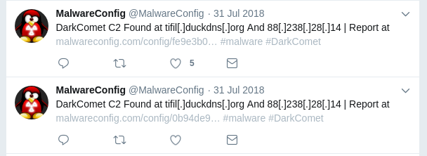
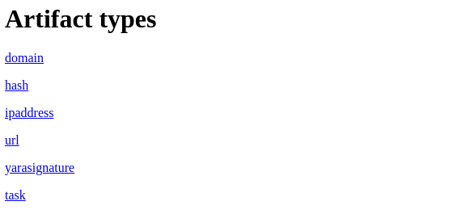
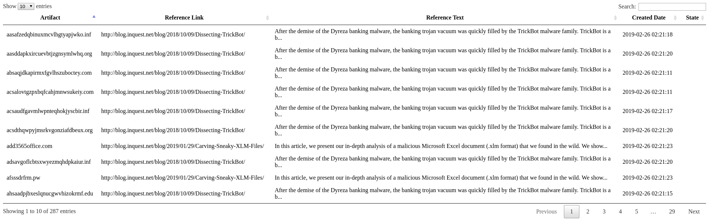

Welcome to ThreatIngestor
=========================

.. _what-is-it:

What is ThreatIngestor?
-----------------------

ThreatIngestor helps you collect :term:`threat intelligence` from public feeds, and gives you context on that intelligence so you can research it further, and put it to use protecting yourself or your organization.

There is a never-ending stream of publicly available information on malicious activies online, but compiling all that information manually can take a lot of manual effort and time. ThreatIngestor automates as much of that work as possible, so you can focus on more important things.

   A screenshot of Twitter user `@MalwareConfig`_'s feed, showing two tweets with :term:`defanged` :term:`C2` domains and IP addresses.

Because it is completely modular and configuration-driven, ThreatIngestor is super flexible, and should fit easily into any threat intel workflow.

.. _try-it-out:

Try it out
----------

If you want to try ThreatIngestor right now, here's the quickest way to get up and running:

First, make sure you have Python 3.6+ and pip installed::

    $ python3 -V
    Python 3.6.6
    $ python3 -m pip -V
    pip <...> from <...> (python 3.6)

(If you don't, you'll want to find installation instructions for Python and pip specific to your operating system.)

Next, install ThreatIngestor and the dependencies we'll be using::

    python3 -m pip install threatingestor feedparser hug

Download `this example configuration file`_, and run ThreatIngestor::

    threatingestor inquest-blog-sqlite.yml

After several seconds, the command should exit without any errors, and you should see a new file ``artifacts.db`` in the same folder where you ran the command. That's where all the intel we gathered is stored.

Fire up the quick web interface that comes with ThreatIngestor::

    hug -m threatingestor.extras.webapp

And open ``http://localhost:8000/`` in your web browser. You should see something like this:

   The ThreatIngestor quick web interface, index.

Click on one of the links to view all the artifacts of that type that were collected.

   The ThreatIngestor quick web interface, domains table.

That's it!

In a real environment, you would probably use something like ThreatKB_ or MISP_ to store your artifacts, instead of just an SQLite database like the one this quick web interface is reading from. If you wanted to do some automated investigation of the things you find, instead of just tossing them into a database, you could do that too.

For more ThreatIngestor tutorials, take a look at the `InQuest blog`_.

Support
-------

If you need help getting set up, or run into any issues, feel free to open an Issue_. You can also reach out to `@InQuest`_ on Twitter.

We'd love to hear any feedback you have on ThreatIngestor, its documentation, or how you're putting it to work for you!

.. _@MalwareConfig: https://twitter.com/MalwareConfig
.. _this example configuration file: _static/inquest-blog-sqlite.yml
.. _ThreatKB: https://github.com/InQuest/ThreatKB
.. _MISP: https://www.misp-project.org/
.. _Issue: https://github.com/InQuest/ThreatIngestor/issues
.. _@InQuest: https://twitter.com/InQuest
.. _InQuest blog: https://inquest.net/taxonomy/term/42
