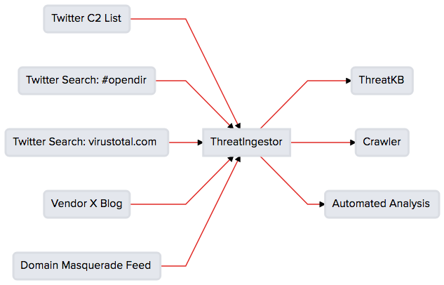
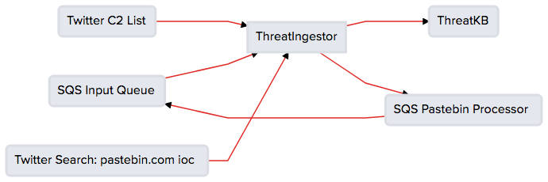
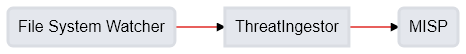
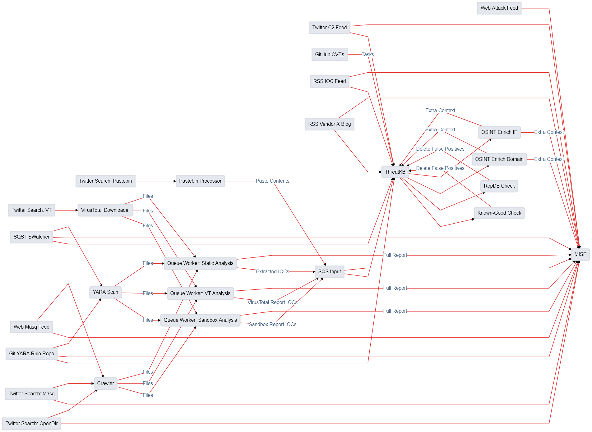

.. _example-workflows:

Example Workflows
=================

The :ref:`standard use case <standard-case>` for ThreatIngestor is pretty simple - just pull from Twitter and RSS, extract IOCs, and send them to ThreatKB. That said, there is a *lot* more you can do with just a few changes to the configuration file. Here, we'll go over some more advanced use cases, to give you an idea what this tool can do.

.. _multiple-operator-workflow:

Multiple Operators
------------------

By adding more than one operator, you can tell ThreatIngestor to send artifacts to multiple locations. This might be useful if you want to send to ThreatKB while also writing out a local log file. Combine this with a few :ref:`operator options <operator-plugins>` though, and you can now send *specific* artifacts to different operators depending on type, source, or advanced filters. Consider the following workflow:

We want artifacts from "Twitter C2 List" and "Vendor X Blog" to go directly to ThreatKB. URLs and domains from "Twitter Search: #opendir" and "Domain Masquerade Feed" should go to our crawler, which will look for malicious content or evidence of phishing attacks. Any URLs from "Twitter Search: virustotal.com" that match the filter for a direct URL to a sample should be sent to our "Automated Analysis" system, which will log in to VirusTotal, download the sample, and analyze it. We don't want to see VirusTotal links or open directories in ThreatKB though, because those aren't C2s. This config accomplishes all of that:

.. code-block:: yaml

    general:
        daemon: true
        sleep: 900
        state_path: state.db

    credentials:
      - name: twitter-auth
        api_key:
        api_secret_key:
        access_token:
        access_token_secret:

      - name: threatkb-auth
        url: http://mythreatkb
        token: MYTOKEN
        secret_key: MYKEY

      - name: aws-auth
        aws_access_key_id: MYKEY
        aws_secret_access_key: MYSECRET
        aws_region: MYREGION

    sources:
      - name: twitter-feed-c2
        module: twitter
        credentials: twitter-auth
        username: InQuest

      - name: twitter-search-opendir
        module: twitter
        credentials: twitter-auth
        query: '#opendir'

      - name: twitter-search-vt
        module: twitter
        credentials: twitter-auth
        query: virustotal.com

      - name: vendor-x
        module: rss
        url: http://example.com/rss.xml
        feed_type: messy

      - name: domain-masq-feed
        module: web
        url: http://example.com/feed.txt

    operators:
      - name: my-threatkb
        module: threatkb
        credentials: threatkb-auth
        allowed_sources: [twitter-feed-c2, vendor-x]
        state: Ingestor

      - name: my-crawler
        module: sqs
        credentials: aws-auth
        allowed_sources: [twitter-search-opendir, domain-masq-feed]
        artifact_types: [URL]
        queue_name: crawler
        domain: {domain}
        url: {url}
        source_type: url

      - name: my-analyzer
        module: sqs
        credentials: aws-auth
        allowed_sources: [twitter-search-vt]
        filter: https?://virustotal.com/.*/analysis
        artifact_types: [URL]
        queue_name: analyzer
        url: {url}
        source_type: virustotal

Note that in this example, our Crawler and Automated Analysis systems will be watching the configured SQS queues for new artifacts. You can use SQS, or add your own :ref:`custom operator plugins <custom-operator-plugins>` to send artifacts wherever you want.

.. _full-circle-workflow:

Full-Circle
-----------

ThreatIngestor can both :ref:`read from <sqs-source>` and :ref:`write to <sqs-operator>` SQS queues, which allows us to set up a "full circle" workflow. (Note that you can also replace SQS with :ref:`Beanstalk <beanstalk-source>` or :ref:`custom plugins <developing>` to achieve the same effect.) In this workflow, we can extract artifacts from a source, send them off to some SQS listener for processing, and that listener can send the processed content back into ThreatIngestor's input queue for extraction. Consider the following workflow:

Here, we have two Twitter sources: our C2 list and a search for "pastebin.com ioc", and one SQS source: the input queue. We then have two operators: ThreatKB, and an SQS Pastebin Processor application. We want all the C2s we pull from the Twitter C2 list to go directly to ThreatKB. We also want any pastebin links from either Twitter source to be sent to the SQS Pastebin Processor. That Processor will grab the raw text from the pastebin link, and send it to the ThreatIngestor input queue, where all the IOCs will be extracted and sent to ThreatKB for further analysis. Here's an example config file that accomplishes all that:

.. code-block:: yaml

    general:
        daemon: true
        sleep: 900
        state_path: state.db

    credentials:
      - name: twitter-auth
        api_key:
        api_secret_key:
        access_token:
        access_token_secret:

      - name: threatkb-auth
        url: http://mythreatkb
        token: MYTOKEN
        secret_key: MYKEY

      - name: aws-auth
        aws_access_key_id: MYKEY
        aws_secret_access_key: MYSECRET
        aws_region: MYREGION

    sources:
      - name: twitter-feed-c2
        module: twitter
        credentials: twitter-auth
        username: InQuest

      - name: twitter-search-pastebin
        module: twitter
        credentials: twitter-auth
        query: pastebin.com ioc

      - name: sqs-input
        module: sqs
        credentials: aws-auth
        queue_name: threatingestor

    operators:
      - name: my-threatkb
        module: threatkb
        credentials: threatkb-auth
        allowed_sources: [sqs-input, twitter-feed-c2]
        state: Ingestor

      - name: pastebin-processor
        module: sqs
        credentials: aws-auth
        allowed_sources: [twitter-feed-c2, twitter-search-pastebin]
        artifact_types: [URL]
        filter: https?://pastebin.com/.+
        queue_name: pastebin-processor
        url: {url}

.. _queue-worker-workflow:

Queue Workers
-------------

The ThreatIngestor :ref:`plugin architecture <developing>` lets developers integrate with external systems with relative ease - but not everything makes sense as a plugin. Both source and operator plugins are expected to run to completion quickly, then exit and wait for the next run before working again. For long-running tasks (think VirusTotal / MultiAV scan, malware sandbox, web crawler, domain brute force, etc), implementing them as plugins that block until completion would break the workflow. Instead, consider using a queue workflow.

In a typical queue workflow, an operator should queue up jobs for each artifact it receives (typically with :ref:`SQS <sqs-operator>` or :ref:`Beanstalk <beanstalk-operator>`), and an external tool we'll call a **queue worker** should read from that queue and perform any necessary long-running tasks. When the tasks are complete, the queue worker should send a job to another queue, where it can be picked up by a ThreatIngestor queue source (like the :ref:`SQS <sqs-source>` and :ref:`Beanstalk <beanstalk-source>` sources).

.. note::

    In the "Full-Circle" workflow above, the "SQS Pastebin Processor" is a queue worker.

Lets look at an example of a queue workflow using one of the provided queue workers, the **File System Watcher**.

Let's say we want to watch a directory for new YARA rules, and automatically send them to our MISP server. Here's how the ThreatIngestor config would look:

.. code-block:: yaml

    general:
        daemon: true
        sleep: 900
        state_path: state.db

    credentials:
      - name: misp-auth
        url: http://mymisp
        key: MYKEY
        ssl: false

      - name: aws-auth
        aws_access_key_id: MYKEY
        aws_secret_access_key: MYSECRET
        aws_region: MYREGION

    sources:
      - name: fs-watcher
        module: sqs
        credentials: aws-auth
        queue_name: yara-rules
        paths: [content]
        reference: filename

    operators:
      - name: misp
        module: misp
        credentials: misp-auth
        artifact_types: [YARASignature]

In a separate file (we'll use ``fswatcher.yml``), set up the config for the queue worker:

.. code-block:: yaml

    module: sqs
    aws_access_key_id: MYKEY
    aws_secret_access_key: MYSECRET
    aws_region: MYREGION
    out_queue: yara-rules
    watch_path: MY_RULES_FOLDER

Run the included File System Watcher::

    python3 -m threatingestor.extras.fswatcher fswatcher.yml

When new YARA rules are added to ``MY_RULES_FOLDER``, the File System Watcher sends jobs to the ``yara-rules`` queue:

.. code-block:: json

    {
        "rules": "rule myNewRule { condition: false }",
        "filename": "mynewrule.yara"
    }

Run ThreatIngestor, and it'll read from the ``yara-rules`` queue, extracting artifacts from the ``content`` field in the job, and using the ``filename`` as the artifact's reference text. When it finds YARA rules, it will send them off through the MISP operator.

By combining custom plugins with custom queue workers, developers can extend ThreatIngestor functionality to fit arbitrarily complex intel workflows.

.. _automation-workflow:

Automate as Much as Possible
----------------------------

Everything in ThreatIngestor is built around the basic idea that some intel tasks can be automated, and some can't. The goal, then, is to automate everything that can be, and give as much information to the person doing the analysis as possible.

Up to this point, all our workflows have followed pretty similar patterns: we read in a bunch of information, extract what looks interesting, and send it off for storage somewhere. We're assuming there's an analyst at the end of that process, looking at the information we've extracted, weeding out false positives, and making decisions on what is actually important. ThreatIngestor provides the artifacts, and some context to give the analyst a starting point to begin their research. But could we go a step further, and automate some of the repetitive research tasks too? Let's see how far we can take this...

Investigating network artifacts
~~~~~~~~~~~~~~~~~~~~~~~~~~~~~~~

URLs, domains, and IP addresses all represent some kind of network resource, but what we want to do with them can be completely different depending on the context.

Suppose we're getting some network artifacts that we know are :term:`C2` endpoints. For these, the end goal is to verify they're malicious, and block any communication with them to prevent malicious activity.

We have some feeds that tell us about active attacks coming from certain IPs. These could be from something like failed SSL login attempts in our server logs, public honeypots, or sites like DShield that monitor global attack patterns. Depending on the severity and trustworthiness of the source, we might want to just block these, or dig up some extra information to see if we need to take more specific action.

We're also getting another set of network artifacts that we know are "open directories" - publicly accessible links a malicious actor might have used as a drop site for data exfiltration, or to host tools to help them carry out attacks. These can be a treasure trove of new malware samples, stolen information, and clues to help explore the methods of malicious actors; but they often disappear quickly after they've been discovered by a security researcher. For these, the end goal is to clone all the content as quickly and safely as possible, and save it for later investigation.

Other sources are feeding us links to live malicious content: maybe a malware sample we can download from a sandbox or muti-AV, an exploit being used to deliver malicious content, or a second-stage payload being downloaded by a dropper. Whatever it is, the end goal for us is to download and analyze the content, and figure out how we can protect against it.

Finally, we're also getting some artifacts that look like "suspicious masquerades" - websites pretending to be a login page for a bank, a Google account, or some other legitimate resource. For these, the end goal is to crawl the contents and save them for comparison (we can use this information for attribution - linking them back to malicious actors or phishing toolkits), then make sure we're blocking them so no one accidently falls victim to the phishing attempts.

In all of these cases, the automatable actions boil down to a few things:

* Collect metadata (whois, GeoIP, dig, ...)
* Collect content (download, crawl)
* Enrich from public resources (check block lists, reputation databases, network scans like Shodan, ...)
* Block the resource (modify firewalls, generate rules for IDS/IPS, ...)
* Share intelligence (publish intel feeds, push to a ThreatKB/MISP instance, post to places like Twitter and Slack, ...)

Some of these, like the intel sharing, can be set up as simple operators. Others, like checking whois records, or kicking off a crawler, can be queue workers that know what to do with the enrichment information after they gather it.

Often, we'll be enriching artifacts with this additional information. But with the right sources, we can help weed out false positives too! Decreasing the amount of noise the analyst sees saves time and effort for more important things. If we see a domain in a list of known-good sites, maybe we just delete the artifacts altogether, or flag them as probable false positives and provide context as to why.

Investigating file artifacts
~~~~~~~~~~~~~~~~~~~~~~~~~~~~

Hashes, YARA signatures, and sometimes URLs can all carry information about interesting files.

When we're using Twitter and RSS sources, the most common file artifacts will most likely be hashes. These are typically either malicious software samples (executables, PDF or Word documents, etc), or "dropped files" that were left behind as traces of a sample's execution. Obtaining the original hashed file is sometimes possible through paywalled services like VirusTotal Enterprise, searching free malware corpora, or simply asking the threat intel community if anyone has a copy of the file. If those methods fail, the hash can still be used as a universally understandable reference to uniquely identify the file and perhaps find scan results or existing research describing the file's capabilities.

YARA signatures can be run over existing malware corpora, or used with threat hunting services like those provided by VirusTotal Enterprise or `Hybrid Analysis YARA search`_, to find matching files.

URLs to "open directories," direct downloads, or mirrored samples hosted by threat intel sites are a great way to get copies of a file for more detailed analysis.

When working with files, the automatable actions look something like this:

* Find samples (download from a URL, find public samples from a hash, run YARA signatures over a corpora to find matches, ...)
* Enrich from public resources (search for a hash on multi-AV and sandbox sites, check reputation databases, ...)
* Perform automated static analysis (AV scan, metadata extraction, ...)
* Perform automated dynamic analysis (run in a sandbox)
* Save the file somewhere for manual analysis
* Block the file (generate YARA signatures, add hashes to a block list, ...)
* Share intelligence (publish intel feeds, push to ThreatKB/MISP instance, mirror content for download, post to places like Twitter and Slack, ...)

Again, some of these can be accomplished with operator plugins, while others will require custom queue workers.

Doing it all
~~~~~~~~~~~~

The filtering capabilities of ThreatIngestor mean that no matter what your workflow looks like, you should always be able to automate everything with a single config file.

Lets see what it looks like if we put everything together in once place:

And the ThreatIngestor config file:

.. code-block:: yaml

    general:
        daemon: true
        sleep: 900
        state_path: state.db

    credentials:
      - name: twitter-auth
        # https://dev.twitter.com/oauth/overview/application-owner-access-tokens
        api_key:
        api_secret_key:
        access_token:
        access_token_secret:

      - name: virustotal-auth
        api_key: API_KEY

      - name: github-auth
        username: user
        # Could also use password instead https://github.blog/2013-05-16-personal-api-tokens/
        # https://github.com/settings/tokens
        token: TOKEN_OR_PASSWORD

      - name: threatkb-auth
        url: http://mythreatkb
        token: MYTOKEN
        secret_key: MYKEY

      - name: misp-auth
        url: http://mymisp
        key: MYKEY
        ssl: false

      - name: aws-auth
        aws_access_key_id: MY_KEY
        aws_secret_access_key: MY_SECRET
        aws_region: MY_REGION

    sources:
      - name: twitter-feed-c2
        module: twitter
        credentials: twitter-auth
        username: InQuest

      - name: twitter-open-directory
        module: twitter
        credentials: twitter-auth
        # https://developer.twitter.com/en/docs/tweets/search/api-reference/get-search-tweets.html
        query: '"open directory" #malware'

      - name: twitter-search-opendir
        module: twitter
        credentials: twitter-auth
        query: '#opendir'

      - name: twitter-masq
        module: twitter
        credentials: twitter-auth
        query: "domain masquerade"

      - name: twitter-search-vt
        module: twitter
        credentials: twitter-auth
        query: virustotal.com

      - name: twitter-search-pastebin
        module: twitter
        credentials: twitter-auth
        query: pastebin.com ioc

      - name: github-cve18
        module: github
        credentials: github-auth
        search: CVE-2018-

      - name: github-gist-search
        module: github_gist
        credentials: github-auth
        user: InQuest

      - name: git-yara-rules
        module: git
        url: https://github.com/InQuest/yara-rules.git
        local_path: /opt/threatingestor/git/yara-rules

      - name: rss-myiocfeed
        module: rss
        url: https://example.com/rss.xml
        feed_type: messy

      - name: rss-vendor-x
        module: rss
        url: http://example.com/rss.xml
        feed_type: messy

      - name: sqs-input
        module: sqs
        credentials: aws-auth
        queue_name: threatingestor
        paths: [content]
        reference: reference

      - name: sqs-fswatcher
        module: sqs
        credentials: aws-auth
        queue_name: fswatcher
        paths: [content]
        reference: filename

      - name: domain-masq-feed
        module: web
        url: http://example.com/masquerades.txt

      - name: attack-feed
        module: web
        url: http://example.com/attacks.txt

      - name: sitemap-xml-parser
        module: sitemap
        url: https://inquest.net/sitemap.xml

      - name: image-ioc-extraction
        module: image
        url: local.jpg

      - name: vt-comments-inquest
        module: virustotal
        user: 'inquest.labs'
        credentials: virustotal-auth
        limit: 10

    operators:
      - name: mythreatkb
        module: threatkb
        credentials: threatkb-auth
        allowed_sources: [twitter-feed-c2, rss-.*, git-.*, sqs-.*]
        state: Inbox

      - name: mymisp
        module: misp
        credentials: misp-auth

      - name: pastebin-processor
        module: sqs
        credentials: aws-auth
        allowed_sources: [twitter-feed-c2, twitter-search-pastebin]
        artifact_types: [URL]
        filter: https?://pastebin.com/.+
        queue_name: pastebin-processor
        url: {url}

      - name: my-crawler
        module: sqs
        credentials: aws-auth
        allowed_sources: [twitter-search-opendir, domain-masq-feed]
        artifact_types: [URL]
        queue_name: crawler
        domain: {domain}
        url: {url}
        source_type: url

      - name: my-analyzer
        module: sqs
        credentials: aws-auth
        allowed_sources: [twitter-search-vt]
        filter: https?://virustotal.com/.*/analysis
        artifact_types: [URL]
        queue_name: analyzer
        url: {url}
        source_type: virustotal

      - name: osint-enrich-domain
        module: sqs
        credentials: aws-auth
        artifact_types = [URL]
        filter: is_domain
        queue_name: osint-enrich-domain
        domain: {domain}

      - name: osint-enrich-ip
        module: sqs
        credentials: aws-auth
        artifact_types = [URL]
        filter: is_ip
        queue_name: osint-enrich-ip
        ip: {domain}

      - name: repdb-check
        module: sqs
        credentials: aws-auth
        artifact_types = [URL, IPAddress, Domain]
        queue_name: repdb-check
        artifact: {artifact}

      - name: yara-scan
        module: sqs
        credentials: aws-auth
        artifact_types = [YARASignature]
        queue_name: yara-scan
        rule: {artifact}

      - name: virustotal-downloader
        module: sqs
        credentials: aws-auth
        artifact_types = [Hash, URL]
        allowed_sources: [twitter-search-vt]
        queue_name: vt-downloader
        content: {artifact}

Hopefully, this gives some idea what exactly ThreatIngestor is capable of. Whether you are looking to detect and respond to zero-day threats, keep up with the intel community, share your own research, or just block phishing domains on your home network, anything is possible.

.. _Hybrid Analysis YARA search: https://www.hybrid-analysis.com/yara-search
